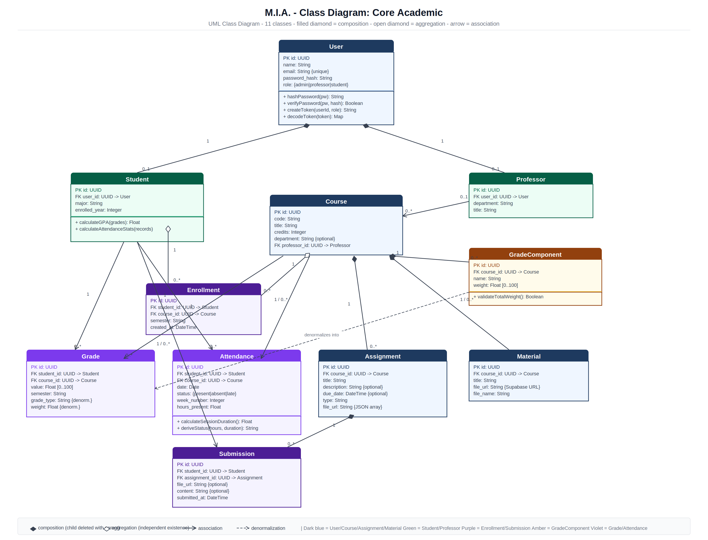
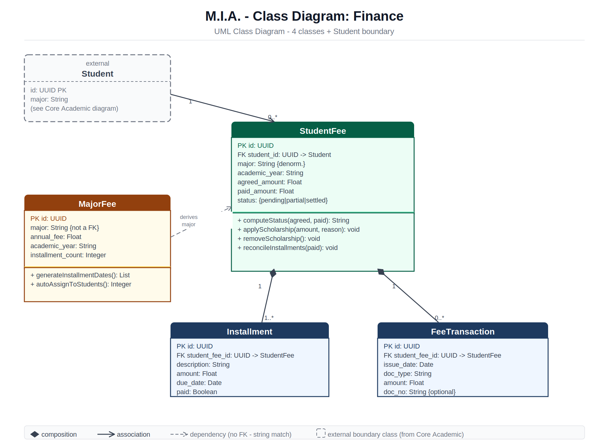
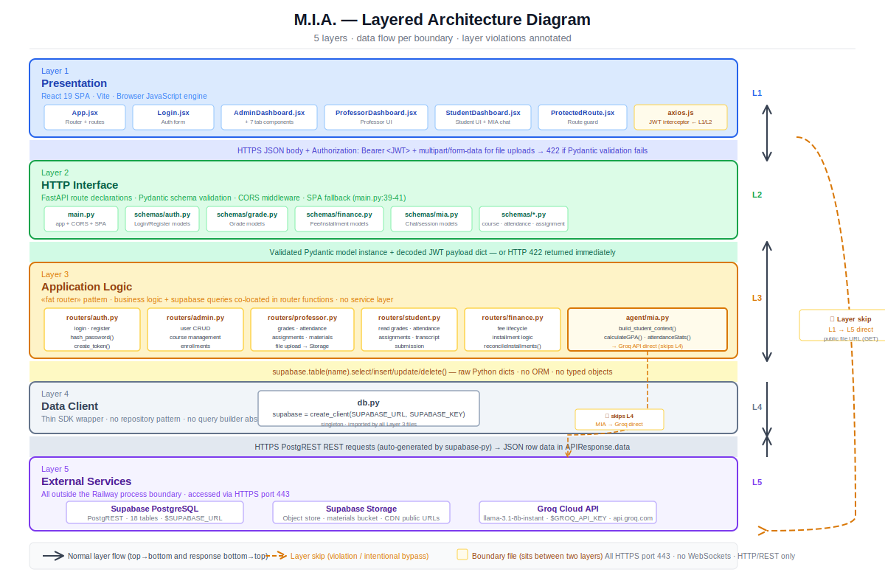
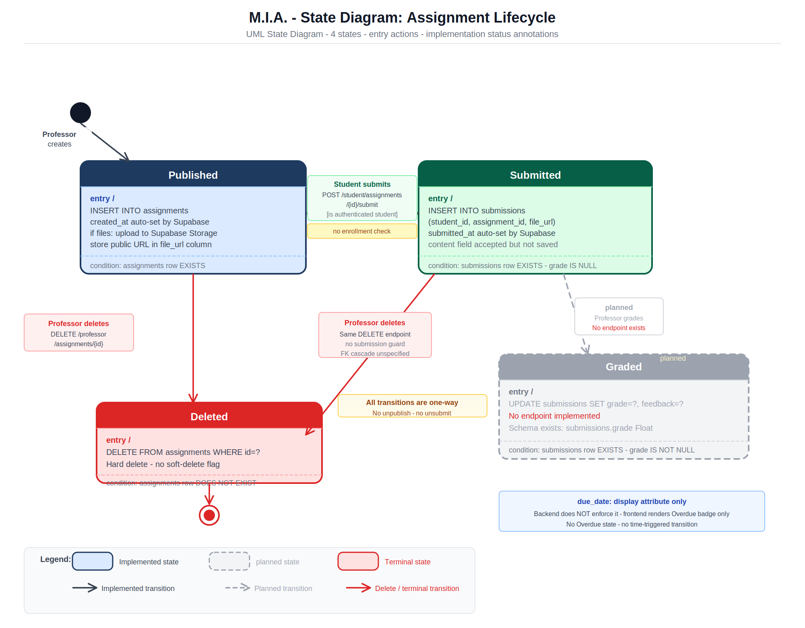
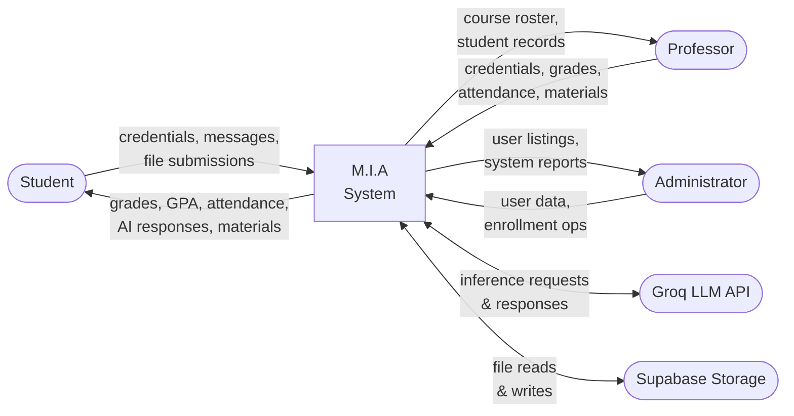
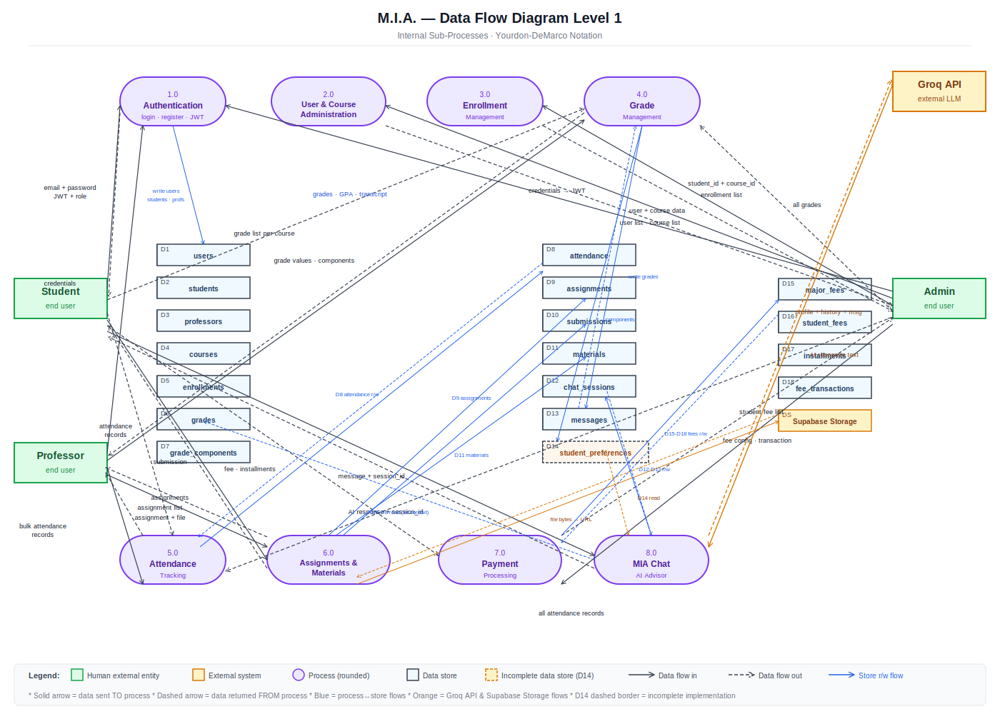

# ERD — Database Schema

# Class Diagram — Core Academic

**Classes:** User, Student, Professor, Course, Enrollment, Grade, GradeComponent, Attendance, Assignment, Submission, Material

Relationships: composition (Course → GradeComponent), aggregation (User → Student/Professor), association across enrollment, grade, attendance, assignment, and submission boundaries.

---

# Class Diagram — Finance

**Classes:** StudentFee, MajorFee, Installment, FeeTransaction — with external Student boundary from Core Academic diagram.

StudentFee composes Installment and FeeTransaction. MajorFee derives major-level fee rules and auto-assigns to students.

---

# Layered Architecture

5-layer architecture:

| Layer | Name | Key files |
|-------|------|-----------|
| L1 | Presentation | React 19 SPA — `App.jsx`, dashboard components, `axios.js` |
| L2 | HTTP Interface | FastAPI routes, Pydantic schemas, CORS — `main.py`, `schemas/*.py` |
| L3 | Application Logic | Fat-router pattern — `routers/*.py`, `agent/mia.py` |
| L4 | Data Client | Thin Supabase SDK wrapper — `db.py` |
| L5 | External Services | Supabase PostgreSQL, Supabase Storage, Groq Cloud API |

Layer skip noted: `agent/mia.py` (L3) calls Groq directly, bypassing L4. `axios.js` serves L1 and L2 boundary.

---

# Use Cases — Actor-Specific Diagrams

## Administrator Use Cases

**Responsibilities:** Create/update users, assign roles, view system reports, manage tuition fees, configure payment plans, track payments

---

## Professor Use Cases

**Responsibilities:** Create courses, upload materials, manage assignments, record grades, track attendance, view class roster, enroll students

---

## Student Use Cases

**Responsibilities:** View courses, check grades/GPA, view attendance, download transcript, submit assignments, view tuition balance, track payments, chat with M.I.A

**M.I.A (AI Agent):** Answer academic questions, recommend courses, track graduation progress, remember preferences (exclusive to student portal)

# Login Flow

# M.I.A Chat Flow

# Assignment Submission Flow

# State Diagram — Assignment Lifecycle

4 states: **Published** → **Submitted** → **Graded** | **Deleted**

- **Published**: Professor creates assignment; INSERT into `assignments`, file uploaded to Supabase Storage
- **Submitted**: Student submits (enrolled only); INSERT into `submissions`, file auto-set by Supabase
- **Graded**: UPDATE `submissions SET grade=?, feedback=?` — endpoint planned, not yet implemented
- **Deleted**: Hard delete from `assignments`; cascades to submissions

All transitions one-way. `due_date` display only — no overdue transition implemented.

---

# DFD Level 0 — Context Diagram

# DFD Level 1 — Process Detail

**Processes:** 1.0 Authentication · 2.0 Enrollment · 3.0 Grade · 4.0 Attendance · 5.0 Assignments & Materials · 6.0 Payment · 7.0 MIA Chat

**Data stores:** Users & Profiles · Academic Records (courses, grades, enrollments) · Assignments & Submissions · Course Materials · Chat Sessions & Messages

**External entities:** Student, Professor, Admin · Groq API (inference)