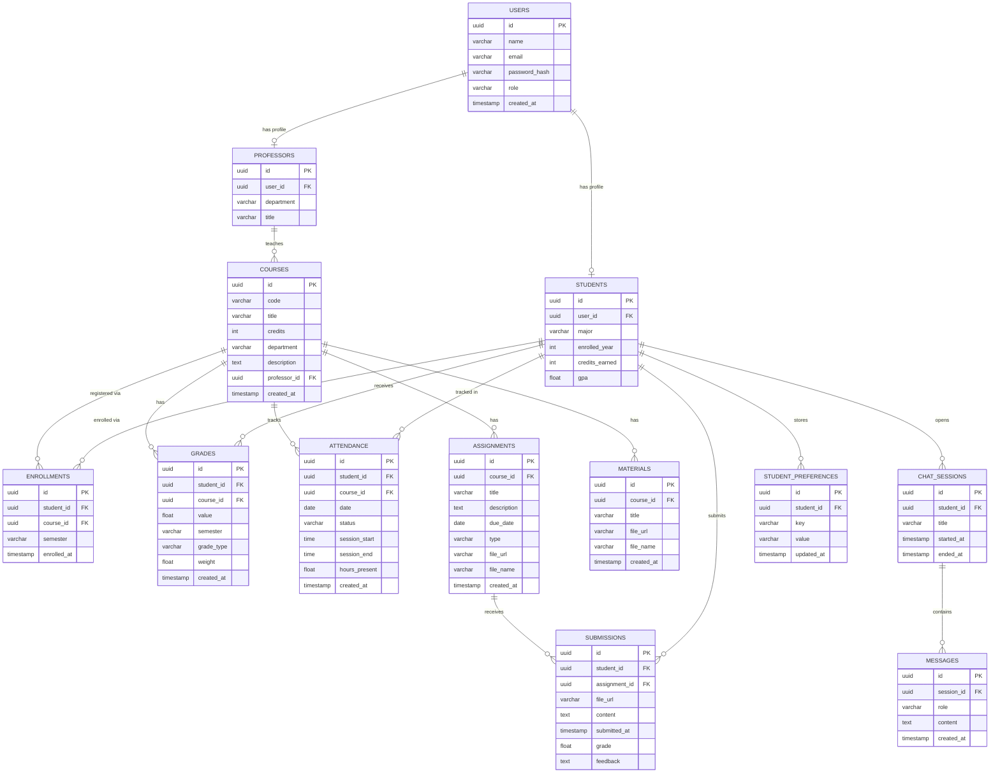
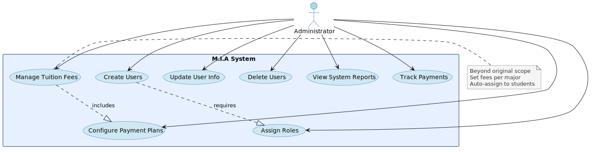
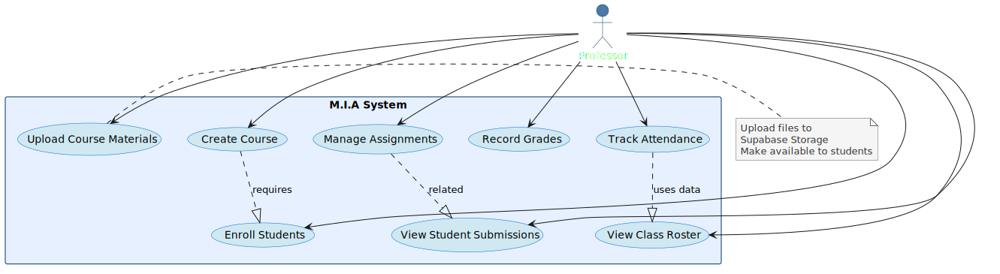
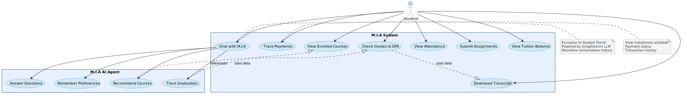
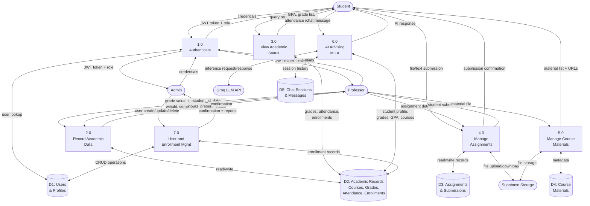

# ERD — Database Schema

# Use Cases — Actor-Specific Diagrams

## Administrator Use Cases

**Responsibilities:** Create/update users, assign roles, view system reports, manage tuition fees, configure payment plans, track payments

---

## Professor Use Cases

**Responsibilities:** Create courses, upload materials, manage assignments, record grades, track attendance, view class roster, enroll students

---

## Student Use Cases

**Responsibilities:** View courses, check grades/GPA, view attendance, download transcript, submit assignments, view tuition balance, track payments, chat with M.I.A

**M.I.A (AI Agent):** Answer academic questions, recommend courses, track graduation progress, remember preferences (exclusive to student portal)

# Login Flow

# M.I.A Chat Flow

# Assignment Submission Flow

# DFD Level 0 — Context Diagram

# DFD Level 1 — Process Detail

